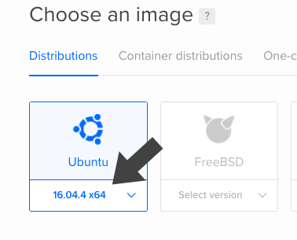

# Coronium ChatterBox

__A Lua based chat/messaging server and client for use with [Corona](https://coronalabs.com).__

## Installation

__Coronium ChatterBox__ runs best on a __[DigitalOcean](https://m.do.co/c/cddeeddbbdb8) Ubuntu 17.04__ droplet.

!!! tip
    If you're new to [DigitalOcean](https://m.do.co/c/cddeeddbbdb8) please consider signing up with __[this link](https://m.do.co/c/cddeeddbbdb8)__. Not only will you receive a $10 credit (2 free months), but it also helps support the continued development, and testing of __Coronium ChatterBox__.


### Create A New Droplet

Once you log into your [DigitalOcean](https://m.do.co/c/cddeeddbbdb8) account, click the __Create__ button and select __Droplets__ from the menu.


On the next screen, first select a __Ubuntu 17.04__ droplet distribution.

 

Select your preferred droplet size. A __512MB/1 CPU__ droplet is a good starting point. You can always increase the size later.


Next, select a region for the droplet. Consider choosing a location closest to your most active user base.


Select your SSH profile to attach to the droplet.


!!! caution
    There is an option where you can use a password instead of an SSH key, which may be easier if you're only testing __Coronium ChatterBox__, though I wouldn't recommend it. You can learn more about generating SSH keys for [DigitalOcean](https://m.do.co/c/cddeeddbbdb8) here: [Creating SSH Keys](https://www.digitalocean.com/community/tutorials/how-to-use-ssh-keys-with-digitalocean-droplets).

Now give your droplet a hostname.


_Be sure to replace __cbox.develephant.com__ with your own hostname._

!!! warning
    Do not use __chatterbox__ as your subdomain, or the server monitor will refuse to start. You can however use __chatterbox-1__, etc.

And finally, click the __Create__ button to spin up the droplet.


### Connect To The Droplet

Once your droplet is done spinning up, note the ip address.


Using a terminal/shell of your choice, SSH into the droplet.

!!! tip
    You can use the built in shells on both OSX and Linux. For Windows, check out __[PuTTY](https://www.chiark.greenend.org.uk/~sgtatham/putty/latest.html)__.

```
ssh root@<your-instance-ip>
```

_Replace __<your-instance-ip\>__ with the address that was assigned to your droplet._

Once you are connected to the droplet, copy and paste the following line into the terminal:

`curl -LO https://s3.amazonaws.com/coronium-cb/cb.sh && sudo bash ./cb.sh && rm cb.sh`

Once the installation is complete, __Coronium ChatterBox__ is ready for connections. Log out of the server by typing __exit__ on the command line.

You can now test the server connection using __telnet__ on your local command prompt:

```
telnet <your-instance-ip> 7175
```

The server should repond with a "handshake" prompt:

```
{"_handshake":1}
```

!!! tip
    The server will disconnect any client who does not properly respond to a handshake request after 5 seconds.

If you need to edit the config, view logs, etc. then log in with the __coronium__ user.

```
ssh coronium@<your-instance-ip>
```


!!! note
    The default password for a fresh install is: __coroniumadmin__.

!!! important
    You should change the default password after the install. Making sure to log in as the __coronium__ user, enter __sudo passwd__ in the shell, and then follow the prompts.

_You can also run __Coronium Chatterbox__ locally, with a standalone binary from the [install repository](https://github.com/develephant/coronium-chatterbox/tree/master/standalone)._